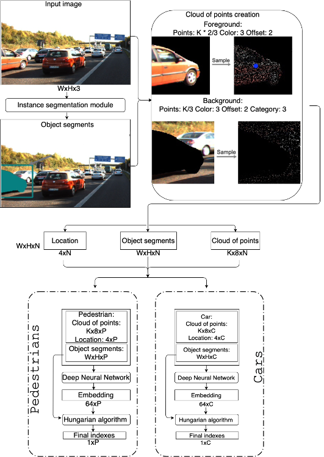
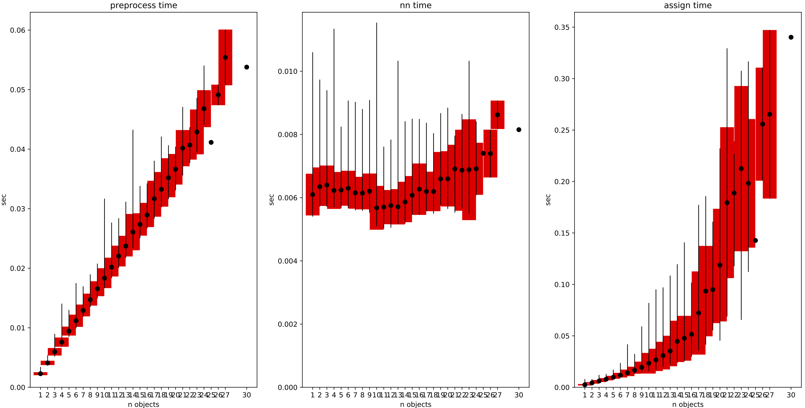
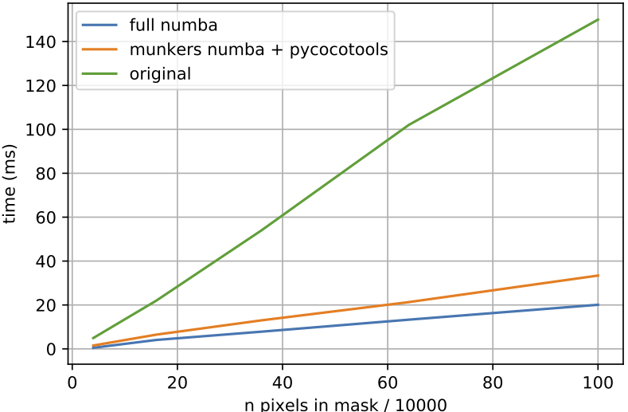
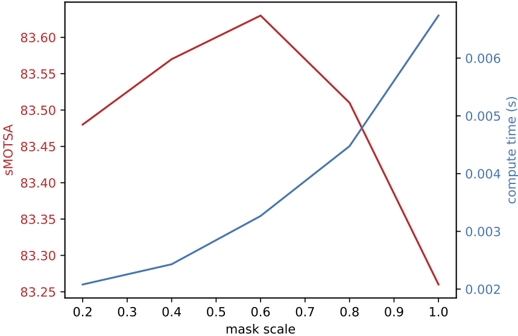
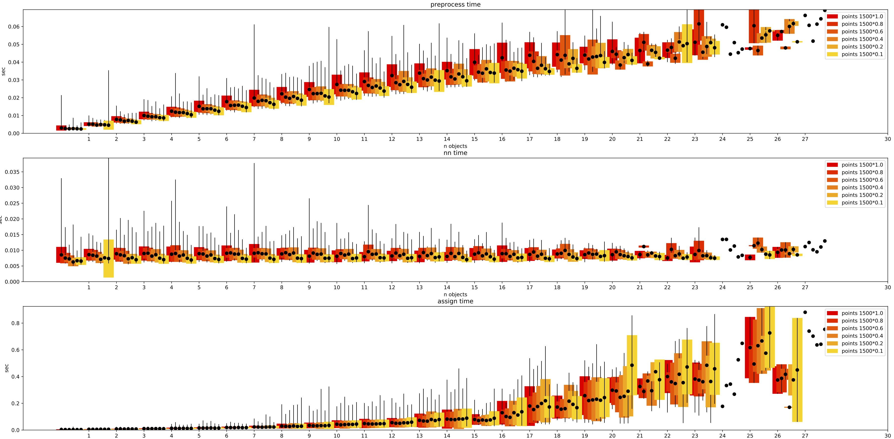

# point_track_improvements

## Overall architecture
The network architecture is presented below:



So, architecture consists of 3 main parts:
- point cloud generation
- neural network inference
- assingment by hangarian algorithm

## Environment

Experements was conducted on:

x86_64:
- GPU: NVIDIA RTX GeForce 2080TI
- CPU: AMD Ryzen Threadripper 1900X 8-Core Processor
- RAM: 110 Gb

aarch:
- JetPack: 4.5
- Model: NVIDIA AGX Xavier

Others:
- Data: KITTI MOTS val
- Detector: [Spatial Embdeddings](https://arxiv.org/abs/1906.11109), [SOLOv2](https://arxiv.org/abs/2003.10152), [HTC](https://arxiv.org/abs/1901.07518)

## Experiments

Time stats based on computer environment

Version | Point cloud (ms) | Neural network (ms) | Assignment problem (ms)
---     | ---              | ---                 | ---
[Initial](https://gitlab.com/sdbcs-nio3/itl_mipt/segm_tracking/alg/tracking/pointtrack/-/blob/indexing_fast/docs/point_track_improvements.md#initial) |  19.2 (+- 10.2)  | 4.3 (+- 0.4)        | 10.7 (+- 3.4)
[GPU PC](https://gitlab.com/sdbcs-nio3/itl_mipt/segm_tracking/alg/tracking/pointtrack/-/blob/indexing_fast/docs/point_track_improvements.md#pointcloud)  |  4.7 (+- 2.8)    | ---                 | ---
[TensorRT](https://gitlab.com/sdbcs-nio3/itl_mipt/segm_tracking/alg/tracking/pointtrack/-/blob/indexing_fast/docs/point_track_improvements.md#tensorrt)  | ---            | 0.3 (+- 0.0)        | ---
[Numba Hangarian](https://gitlab.com/sdbcs-nio3/itl_mipt/segm_tracking/alg/tracking/pointtrack/-/blob/indexing_fast/docs/point_track_improvements.md#numba) | ---      | ---                 | 6.0 (+- 2.0)
[Rescale masks](https://gitlab.com/sdbcs-nio3/itl_mipt/segm_tracking/alg/tracking/pointtrack/-/blob/indexing_fast/docs/point_track_improvements.md#rescale) | ---        | ---                 | 3.1 (+- 1.5)
OVERALL                              | 4.7 (+- 2.8) | 0.3 (+- 0.0)      | 3.1 (+- 1.5)

PS. time stats highly depend on number of input object and type of detector.

### Initial

PointCloud was coputed on CPU, Assignment problem was performed on pure Python code. From table you can see that in time distribution of fuctions Point Cloud and Assingment problem we have big "tails" in std. It can be explained that this time have high dependency on number of input objects.

### PointCloud

After that PointCloud generation was computed on GPU. Computation time depends on number of objects as O(n).



### TensorRT

Using [torch2trt](https://nvidia-ai-iot.github.io/torch2trt/master/getting_started.html) framework, the neural network was converted to FP16=True. The inference time FP16=False was the same, sMOTSA tracking metric was the same in both cases.
Lets see the difference in numerical representations.

```python
embeds = model(points, xyxys)
#fp16 mode
embeds_trt = model_trt(points, xyxys)

abs_error = (embeds - embeds_trt).abs().max()
#output - 0.005
print(abs_error)
```

Also I saw error below 0.005 only in one case in whole KITTI MOTS dataset (error = 1.002), but i cannot explain this behavior.
No experiments have been conducted on INT8.

### Numba

Hugarian algorithm was fully converted to Numba acceleration. Also it is possible to transfer the full tracking algorithm to numba, but it will take more time to develop.



### Rescale

The idea was not to use original full-scale masks in tracking algorithm. Greater detail of masks is achieved by the same rescale to the size of the image (for example, the main size of the YOLACT EDGE is 550x550 pixels, then it expands), so artifacts will be added, and there are "jumps" of mask pixels at the borders that affect the IoU. Because the contour is important to us, we "smooth it out" in this way, thereby improving the quality of work.



### Other studies

We conducted experiments on number of points in pointcloud, also how the IoU impact on tracking accuracy.
At first, you can decrease number of points to increase inference time. But how it will impact on tracking accuracy?


